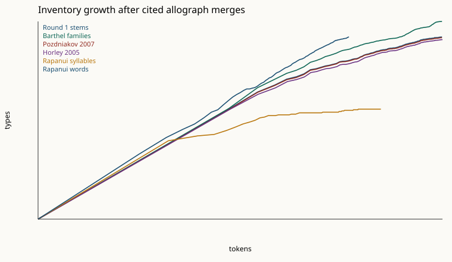

# Round 2, Track A: merge sign variants and rerun the syllabary test

**Verdict: still not a syllabary.** Cited merges do not bring the sign list into the 45–70 band, and the curves do not flatten the way the Thomson syllables do. Round 1 stems: 630 types. Barthel's own suffix rules, with the index letters he used to keep signs apart: 1104 types. Round 1 had stripped those index letters, which is why its inventory is the smaller one. The same suffix rules plus Guy's uncertain catalog corrections: 1091 types. Pozdniakov's published hand merges, ligatures split, no residual bin: 613 types. The uncertain 1996 hundreds-digit rewrite of series 300 and 400: 504 types. Horley's explicit (uncertain) equivalences and decompositions: 573 types. The frequency alignment against Rapanui syllables was not run. No sign is paired with a syllable. `reading` is None.

This is a statistical comparison of the vendored Barthel corpus with the Thomson 1891 Rapanui sample used in Track 2. It is not a decipherment.

## Corpus

Barthel numbers are the Kohaumotu HTML under `tests/fixtures`, the same sides as Track 2 (37 sides). Illegible `000` is dropped. Parenthetical lacunae are dropped. The Rapanui sample is Thomson 1891, love song excluded, orthography `strict` (3400 syllables, 1591 words, 54 words rejected). Wikipedia spans are not added. Details and the chant source notes are in `docs/decipherment/track2_syllabary_test.md` and `data/rapanui/SOURCES.md`.

Round 1 stem baseline on this run: 14488 tokens, 630 types, Heaps β 0.422. Syllables: 3400 tokens, 49 types, β 0.142. Words: 1591 tokens, 633 types, β 0.813. The (C)V ceiling used in Track 2 is 55.

## Merge rules

Each scheme is a switch in `decipherment.allographs.encode_scheme_lines`. Ligature decomposition is a separate switch. A dot or a colon splits `606.076` into `606` and `076`, and `999.440.076` into `999`, `440`, and `076`. With the switch off, those stay one token, and one-to-one maps still rewrite each component. Stacks are not reordered.

Barthel's hundreds digit is a head class (0–1 geometric, 2 ears, 3–4 open mouth, 5 miscellaneous, 6 beak, 7 other animals), and the tens and units digits are limb shapes (Barthel 1958: 40–41; Guy 2006). That is a classification, not an allograph merge. This track does not collapse every code in a hundreds series into one sign. The one hundreds-digit rewrite that is run is Pozdniakov's 1996 proposal, on its own scheme, and it is marked uncertain because the 2007 inventory still lists 380 and 400 separately.

Barthel 1971's figure of about 120 unanalyzable elements was not published as a list and is not reconstructed. Pozdniakov's claim that 52 glyphs cover 99.7% of the corpus (staff excluded) depends on a merge table that was not published. Signs outside the published basic list are left as themselves. They are not folded into a residual bin. Track 2's `pozdniakov_52` mode did that collapse and is not repeated here.

| Rule | Schemes | Uncertain | What it does |
|---|---|---|---|
| `barthel_modification_affixes` | `barthel_families`, `barthel_suffix_only` | no | Strip modification affixes and treat the bare number as the Grundtypus: f feathers, o and s adornments, x upside-down, y mirror, h superscript, t subscript, and the V/D variant or derivation mark. |
| `barthel_keep_index_letters` | `barthel_families`, `barthel_suffix_only` | no | Keep index letters a–d (and CEIPP e, g). Barthel used them to separate distinct signs that share a number. They are not allographs. CEIPP i/j/k (missing head protrusion) are also kept, because Barthel 1958 does not define them as variants. |
| `guy_catalog_corrections` | `barthel_families` | yes | Apply Guy's explicit 'should have been coded as' examples: 545→039, 041→040, 180→126, 380→370, 480→470, 578→570, 579→575, and 160b→160a. Uncertain: examples of catalog inconsistency, not a full corrected list. Glyph 42 = glyph 40 rotated in one stacked pair (Br1) is not applied globally. |
| `pozdniakov_27_orientations` | `pozdniakov_2007`, `pozdniakov_1996_gaping_mouth` | yes | Keep 027a apart from 027b. Map 027x to 027b. Leave bare 027 untouched, because the stemmer cannot see which orientation it was. Uncertain: equating Barthel's x suffix with his 27b index. |
| `pozdniakov_strip_other_indexes` | `pozdniakov_2007`, `pozdniakov_1996_gaping_mouth`, `horley_2005` | yes | Strip index letters other than the 27a/27b distinction. Uncertain: this follows the published labels, and it can merge signs Barthel indexed apart. The 2007 allograph table that would say which indexes are real variants was not published. |
| `hand_6_and_64` | `pozdniakov_2007`, `pozdniakov_1996_gaping_mouth`, `horley_2005` | no | Map isolated hand 064 to 006. The two hand shapes substitute in repeated phrases. |
| `hand_digit_4_to_6` | `pozdniakov_2007`, `pozdniakov_1996_gaping_mouth` | yes | In codes 200–399, rewrite units digit 4 as 6. Uncertain generalization from the published hand pair and Guy's examples to every code in those two series. Not applied to series 400–799, where Guy says the digit system breaks down, and not applied to isolated 004 (Guy: digits 1–7 in isolation are different signs, except 6). |
| `abstract_56_and_84` | `pozdniakov_2007`, `pozdniakov_1996_gaping_mouth` | yes | Map 084 to 056. Uncertain: one parallel pair of abstract signs, not a series rule. |
| `gaping_mouth_to_bird` | `pozdniakov_1996_gaping_mouth` | yes | Rewrite hundreds digit 3 or 4 as 6, after the hand-digit rewrite. Uncertain, and superseded by the 2007 basic inventory, which still lists 380 and 400 as separate signs. Not part of the 2007 scheme. A hundreds rewrite is not the unpublished ligature table. |
| `do_not_split_099` | `pozdniakov_2007`, `pozdniakov_1996_gaping_mouth`, `horley_2005`, `barthel_families` | no | Do not decompose 099. Negative rule. |
| `horley_one_to_one` | `horley_2005` | yes | Map 049→048, 058→075, 007→071, 013→070, 103→037, 156→101, 208→200, 209→200 (reduplications of 200), 440→660, 055→005, 059→520, 499→520. Uncertain: Horley's wording is 'possible' or 'suggested'. 208/209 collapsed to 200 loses the reduplication he proposed; it is an inventory test, not his element reading. |
| `horley_head_ranges` | `horley_2005` | yes | Map 521–529→520, 530–539→005, 661–684→660. Uncertain series reading of those paragraphs. |
| `horley_expansions` | `horley_2005` | yes | When ligatures are decomposed, expand 280 and 126 to 070 002, and 386 to 073 006. Uncertain. Not expanded when ligatures are kept whole. |
| `ligature_dot_colon` | `barthel_families`, `barthel_suffix_only`, `pozdniakov_2007`, `pozdniakov_1996_gaping_mouth`, `horley_2005` | no | Option, default on: split 606.076 into 606 and 076, and 999.440.076 into 999, 440, and 076. Off: keep the ligature as one token after per-component maps. |

### Citations

- `barthel_modification_affixes`: Barthel 1958: 38–42; kohaumotu.org corpus/affixes.html; Guy 2006, Rapa Nui Journal 20(1).
- `barthel_keep_index_letters`: Barthel 1958: 38–42; Guy 2006. CEIPP e/g: kohaumotu.org corpus/extended.html.
- `guy_catalog_corrections`: Guy 2006, Rapa Nui Journal 20(1), on Barthel 1958: 40–41.
- `pozdniakov_27_orientations`: Pozdniakov & Pozdniakov 2007, as tabulated in Wikipedia 'Rongorongo' (the 52-sign inventory, note on 27a/27b); Barthel's x affix, kohaumotu.org corpus/affixes.html.
- `pozdniakov_strip_other_indexes`: Pozdniakov & Pozdniakov 2007 published list (bare numbers except 27a); Horley 2005 states equivalences on three-digit Barthel numbers.
- `hand_6_and_64`: Pozdniakov 1996, Journal de la Société des Océanistes 103: 296; Horley 2005 discusses hand 064 corrected to a 600.064 ligature.
- `hand_digit_4_to_6`: Pozdniakov 1996: 296–297, as illustrated by Guy 2006 (tablets P and H: 304/306, 244/246, 254 with hand 4 vs hand 6). Guy 2006: the units digit encodes the hand in series 200 and 300 only.
- `abstract_56_and_84`: Guy 2006, citing Pozdniakov 1997: glyph 56 alternates with glyph 84 on the parallel of Pr1 and Hr1.
- `gaping_mouth_to_bird`: Pozdniakov 1996: 297, via Wikipedia 'Decipherment of rongorongo': gaping-mouth heads are variants of bird heads, so series 300 and 400 are ligatures or variants of series 600.
- `do_not_split_099`: Pozdniakov & Pozdniakov 2007, via Wikipedia 'Decipherment of rongorongo': 099 looks like 095 plus 014 but behaves as its own sign.
- `horley_one_to_one`: Horley 2005, Rapa Nui Journal 19(2): 107–116.
- `horley_head_ranges`: Horley 2005: 005 with heads 530–539; 055b with the same heads; 059 and 499 with heads 520–529; long-beak heads 660–684, with 440 as an allograph.
- `horley_expansions`: Horley 2005: 280 decomposed as 070.002; 126 as that body flipped; 386 replaced by ligature 073.006 in Ca2/Pr9.
- `ligature_dot_colon`: Barthel 1958 coding, as used by Kohaumotu: '.' links signs, ':' stacks them. Guy 1982 and Pozdniakov 1996 read stacks bottom-to-top; this option only splits, it does not reorder.

## Inventory, entropy, and shuffled controls

Heaps β is the OLS slope of log(types) on log(tokens) for n ≥ 50, the same definition as Track 2. h2 is H(next | previous) inside lines (Rao et al., Science 2009). The structure index is `1 - h2(text) / h2(shuffle)` on the unsmoothed conditional entropy. The shuffle keeps the inventory, the line lengths, and the token frequencies (seed 0). Syllable structure index 0.144. Word structure index 0.343.

The Track 2 label uses `classify_writing_system` unchanged: non-linguistic if the structure index is below 0.05 or above 0.85; otherwise syllabic if, at the shared token count, types ≤ 120 and the ratio to the syllable inventory ≤ 1.6; otherwise logographic if types ≥ 250 and the ratio to the word inventory ≥ 0.7; otherwise mixed. That label is not the gate for the alignment. Whole ligatures are labeled logographic because, at 1,591 tokens, the compound inventory is already in the word band. The label describes that size.

| Scheme | Ligatures split | Tokens | Types | β | V(2000) | h2 | Structure | Track 2 label | Gate |
|---|---|---:|---:|---:|---:|---:|---:|---|---|
| Round 1 stems | yes | 14488 | 630 | 0.422 | 301 | 4.888 | 0.098 | mixed | baseline |
| Ligatures kept whole | no | 10698 | 2210 | 0.722 | 712 | 3.644 | 0.095 | logographic | baseline |
| Barthel suffixes only | yes | 14488 | 1104 | 0.498 | 460 | 4.663 | 0.102 | mixed | no |
| Barthel families | yes | 14488 | 1091 | 0.495 | 457 | 4.671 | 0.101 | mixed | no |
| Barthel families, ligatures whole | no | 10711 | 2732 | 0.739 | 850 | 3.348 | 0.087 | logographic | no |
| Pozdniakov 2007 | yes | 14488 | 613 | 0.418 | 296 | 4.896 | 0.098 | mixed | no |
| Pozdniakov 2007, ligatures whole | no | 10711 | 2173 | 0.720 | 701 | 3.676 | 0.096 | logographic | no |
| Pozdniakov 1996 gaping-mouth | yes | 14488 | 504 | 0.378 | 268 | 4.955 | 0.095 | mixed | no |
| Horley 2005 | yes | 14660 | 573 | 0.422 | 268 | 4.896 | 0.096 | mixed | no |
| Horley 2005, ligatures whole | no | 10711 | 2099 | 0.722 | 684 | 3.782 | 0.092 | logographic | no |
| Rapanui syllables | — | 3400 | 49 | 0.142 | 49 | 3.870 | 0.144 | — | baseline |
| Rapanui words | — | 1591 | 633 | 0.813 | — | 1.663 | 0.343 | — | baseline |

### Gate

A scheme enters the syllabary comparison only if it has 45–70 types, Heaps β ≤ 0.25, and at least 80% of its types already seen by token 2000. Those three cuts were set from the requested band and from the Round 1 syllable curve (49 types, β about 0.14, inventory complete by 2,000 tokens) and the Round 1 stem curve (β about 0.42). They were not edited after the merged counts were known. A residual bin cannot pass, because it manufactures the type count.

None of `barthel_suffix_only`, `barthel_families`, `barthel_families_whole`, `pozdniakov_2007`, `pozdniakov_2007_whole`, `pozdniakov_1996_gaping_mouth`, `horley_2005`, `horley_2005_whole` pass. The alignment is not run.

## Position

Among types with frequency at least 10, the share that occur in initial, medial, and final position. For signs the boundary is the inscribed line. For syllables the boundary is the orthographic word. Those are different boundaries, as in Track 2.

| Scheme | Frequent types | In all three line positions |
|---|---:|---:|
| Round 1 stems | 193 | 0.316 |
| Ligatures kept whole | 175 | 0.314 |
| Barthel suffixes only | 209 | 0.287 |
| Barthel families | 211 | 0.289 |
| Barthel families, ligatures whole | 179 | 0.296 |
| Pozdniakov 2007 | 187 | 0.332 |
| Pozdniakov 2007, ligatures whole | 172 | 0.331 |
| Pozdniakov 1996 gaping-mouth | 183 | 0.344 |
| Horley 2005 | 174 | 0.339 |
| Horley 2005, ligatures whole | 166 | 0.331 |

Syllable word-edge rate (frequent types in all three word positions): 0.930 (40 of 43).

## Frequency and positional alignment

Not run. The pre-registered rule is to align frequencies and positions only if a cited scheme is inside the syllabary band and its inventory curve flattens. None did. Track 2 already scored an unmerged stem alignment and did not adopt it; that score is not reused as a reading here.

## What this does not claim

No Barthel code is given a Rapanui syllable, a gloss, or a name. Horley 2005 also suggested syllable values for a few elements, including a reading of glyph 200; those values are not used. The 1996 hundreds-digit rewrite is not Pozdniakov's 2007 inventory. Coverage of the published basic Barthel stems after the 2007 hand merges is 0.540. That is not 99.7%. Bare `027` is not split into 27a and 27b, because the undifferentiated code does not say which one it was. One `027b` and the `027x` forms are kept apart from `027a` only in the Pozdniakov schemes, and the x-to-27b step is marked uncertain.

The Track 2 label is a size comparison with the Thomson sample. Split-ligature rows stay mixed. Whole-ligature rows meet the logographic size gate. The label does not say what the signs mean. Thomson's chants are a damaged 19th-century record. Conditional entropy in the linguistic band is not, by itself, proof of writing (Sproat's critique, as in Track 2).

The run uses `MockProvider` only. Provider calls: 0.
