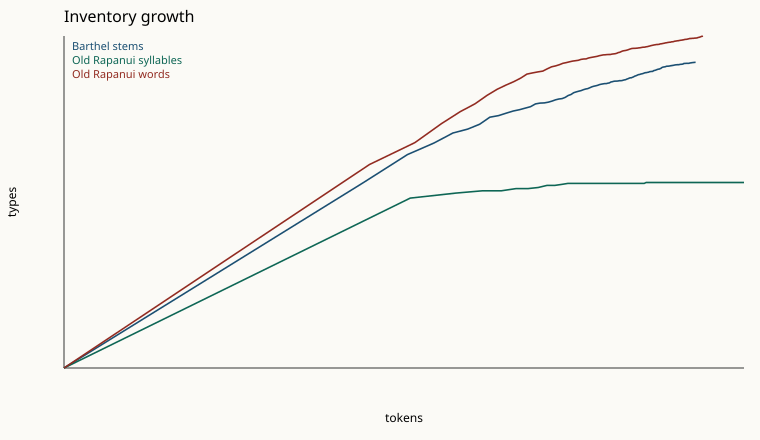

# Round 3, Track C: a larger old-Rapanui comparison corpus

**Verdict: still not a reading.** Primary Barthel stems stay mixed. No cited merge enters the 45–70 band. No anchor crib beats its nulls. Size labels changed for `barthel_suffix_only`, `barthel_families`. `reading` is None.

The Rapanui side is no longer only the Thomson 1891 chants (3400 strict syllables). Primary running text is those chants with the love song excluded, Metoro's recitations for Jaussen, and the timo formula printed by Routledge in 1919, syllabified with the mapped orthography. That sample has 30203 syllables and 16198 words (115 words rejected). The lexicon is kept out of those sequences. This is a statistical comparison. It is not a decipherment.

Provider: `mock`. Provider calls: 0.

## What holds, and what moved

### Conclusions that hold

- The Track 2 label is still mixed: stem sequences stay larger than the Rapanui syllable inventory and smaller than the Rapanui word inventory at the shared token count.
- The Barthel stem inventory is unchanged (630 types, 14488 tokens). The sign corpus was not rebuilt.
- No cited allograph scheme enters the 45–70 type band. The Round 2 gate still does not open, and the frequency alignment is still not run.
- None of H1–H4 spells the crib targets often enough to beat both nulls. No anchor reading is adopted.
- Rapanui syllables still look like a small closed inventory (50 types, Heaps β 0.040), under the ceiling of 55.
- Syllable conditional entropy stays near the Round 1 value (3.87 then, 3.846 now).

### Measurements that moved

- Track 2 labels of these schemes changed against the larger sample: barthel_suffix_only, barthel_families.
- The running-text syllable sample moved from 3400 tokens and 49 types to 30203 tokens and 50 types.
- The running-text word sample moved from 1591 tokens and 633 types to 16198 tokens and 1098 types.
- The crib open list moved from 656 word-shapes to 2843.
- Word conditional entropy moved from 1.663 to 3.872, and word Heaps β from 0.813 to 0.397. The short Thomson sample was hapax-heavy. The larger sample repeats formulae, so word h2 rises and β falls.
- Whole-word phrase scores meet the permutation gate for H1 (6/120 = 0.050; tangata tangata ×25, tangata ure ×8). That fraction sits on the 5% line. The hits are repeated outside pairs read as frequent words. They are not adopted as a reading: the crib-target score is still the gate, and it is zero.
- Open-list hit counts changed for H1, H2, H3, H4. Crib-target hits are reported in the table.

The matched comparison is no longer stuck at 3400 syllables and 1591 words. Stem tokens are 14488. Syllable tokens are 30203. Word tokens are 16198. The shared count is the shorter of the two. At that count, stem types against syllables are 630 versus 50 (ratio 12.600). Stem types against words are 630 versus 1051 (ratio 0.599).

Dropping Metoro's elliptical Mamari and Keiti lines (tablets C and E) leaves the label **mixed** (21713 syllables, 11843 words).

## Sources and copyright

Full notes are in `data/rapanui/SOURCES.md`. Running text and lexicon lists are not mixed.

| Source | Role | What was copied | Status |
|---|---|---|---|
| Thomson 1891 | Running text | Chants already vendored, love song excluded. Raw words in this run: 1591 | US government report, 1891. Public domain |
| Metoro for Jaussen | Running text | 82 tablet lines from the vendored notebook transcription. Full A/B words 10347; elliptical C/E words 4364 | Jaussen died 1891. Notebook wording is public domain. Kohaumotu HTML is copied with attribution, not under the MIT license |
| Routledge 1919 | Running text | The printed formula `He timo te ako-ako`. Raw words: 11 | Published 1919. Author died 1935. Public domain in the UK since 2006 and in the US |
| Churchill 1912 | Lexicon | 2182 headwords. Thomson suffix T on 111. Geiseler suffix Q on 25 | Carnegie Publication 174, 1912. Public domain. Library of Congress: free to use |
| Roussel 1908 | Lexicon, via Churchill | Not a second word list. *Le Muséon* n.s. 9 was inspected; its Rapanui column does not OCR cleanly. Churchill's translation of that vocabulary is the copy used | Roussel died 1898. The 1908 printing is public domain |
| Thomson examples and Routledge names | Lexicon | The short lists already described in `SOURCES.md` | Public domain |
| Wikipedia `lang=rap` | Crib open list only | Not in the running-text entropy | CC BY-SA 4.0, modern orthography |

Not copied: Métraux 1940 (author died 1963; life-plus-70 protection in France and Switzerland runs through 2033, the same standard that excludes Englert), the unpublished Roussel catechism and gospel manuscripts, Englert's dictionary, Fuentes 1960, and any modern dictionary. The 1914–15 Routledge field notebook chant is not in the 1919 book and was not taken from a later article.

Round 1 reproduction on the vendored Thomson file, strict, love song excluded: 3400 syllables, 1591 words, 54 rejected. Orthography `strict`.

## Normalization

Every rule is applied by `decipherment.rapanui.phonemes` and `syllabify_word`, or by the loader that feeds them. Primary orthography is `mapped`.

| Rule | What it does |
|---|---|
| `lowercase` | Case is folded to lowercase before any letter test. |
| `edge_punctuation` | Whitespace tokens lose edge punctuation . , ; : ! ? quotes and brackets. An em dash or en dash becomes a space. A token with no letter is dropped. |
| `digits` | A token that contains a digit is dropped. Sense numbers in Churchill stay off the headword. |
| `macron` | ā ē ī ō ū become a e i o u before other marks are stripped. |
| `combining` | NFKD decomposition, then combining marks are deleted, so â ê î ô û and other accents become plain vowels. |
| `glottal` | ʻ ʼ ꞌ ' ’ ʿ and ʔ become one glottal onset, written as an apostrophe plus the vowel. |
| `eng` | The letter ŋ and the digraph ng are one consonant. The digraph is read before single-letter substitution, so ng is not g. |
| `hyphen` | A hyphen is a reduplication boundary. It is kept in the stored word and removed before syllabification. |
| `mapped_letters` | Orthography mapped, applied only after ng is read: b→p, d→t, f→h, l→r, w→v, c→k, j→h, q→k, y→i, g→ŋ, and s and x are deleted. This is the 19th-century spelling map from Track 2, not a phonetic claim. |
| `reject` | A word is rejected when any remaining segment is not a vowel (a e i o u) or a consonant (p t k m n ŋ h r v ʔ). |
| `syllables` | Syllables are (C)V. A consonant with no following vowel is dropped in running-text syllabification, matching Track 2. Lexicon and crib matching reject that word instead. |
| `streams` | Lexicon headwords are not concatenated into running-text lines. Bigrams do not cross a chant section, a Metoro tablet line, or a Routledge formula. |

A running-text word enters the primary sequences only when `cv_syllables_mapped` accepts it. That rejects a stranded consonant instead of dropping the consonant and keeping the rest, and it rejects the French and English scraps in the Metoro HTML that are not inside italics (115 rejections on the primary lines). Lexicon headwords are not appended to those lines.

## Track 2 inventory, Heaps, and entropy

Gates are the Track 2 gates, unchanged. Structure index of the stems against their own shuffle: 0.098. Round 1 published that index as 0.098. Syllable structure index 0.195 (Round 1 0.144). Word structure index 0.237 (Round 1 0.343).

| Sample | Tokens | Types | β | h2 | Structure |
|---|---:|---:|---:|---:|---:|
| Barthel stems | 14488 | 630 | 0.422 | 4.888 | 0.098 |
| Old Rapanui syllables | 30203 | 50 | 0.040 | 3.846 | 0.195 |
| Old Rapanui words | 16198 | 1098 | 0.397 | 3.872 | 0.237 |
| Round 1 Thomson syllables | 3400 | 49 | 0.142 | 3.870 | 0.144 |
| Round 1 Thomson words | 1591 | 633 | 0.813 | 1.663 | 0.343 |

h2 is H(next | previous) inside lines. The shuffle keeps the inventory, the line lengths, and the token frequencies (seed 0).

## Track A merges

The syllabary gate is unchanged: 45–70 types, Heaps β ≤ 0.25, and at least 80% of types seen by token 2000. It looks at the sign inventory. A larger Rapanui sample does not shrink the sign list. Gate opened: no.

The Track 2 *label* does use the Rapanui sample. Round 2 compared signs with 1,591 Thomson words, so the shared count was 1,591. This run has more word tokens than stem tokens, so the shared count is the full stem length. `barthel_suffix_only` and `barthel_families` keep Barthel's index letters and are therefore large inventories. At that longer shared count they meet the logographic size gate (types ≥ 250 and stem/word ratio ≥ 0.7). The primary stem inventory, which strips those index letters, stays mixed. The label describes size. It does not name a sign.

| Scheme | Tokens | Types | β | h2 | Structure | Label now | Round 2 label | Gate |
|---|---:|---:|---:|---:|---:|---|---|---|
| stem | 14488 | 630 | 0.422 | 4.888 | 0.098 | mixed | mixed | no |
| ligature_atomic | 10698 | 2210 | 0.722 | 3.644 | 0.095 | logographic | logographic | no |
| barthel_suffix_only | 14488 | 1104 | 0.498 | 4.663 | 0.102 | logographic | mixed | no |
| barthel_families | 14488 | 1091 | 0.495 | 4.671 | 0.101 | logographic | mixed | no |
| barthel_families_whole | 10711 | 2732 | 0.739 | 3.348 | 0.087 | logographic | logographic | no |
| pozdniakov_2007 | 14488 | 613 | 0.418 | 4.896 | 0.098 | mixed | mixed | no |
| pozdniakov_2007_whole | 10711 | 2173 | 0.720 | 3.676 | 0.096 | logographic | logographic | no |
| pozdniakov_1996_gaping_mouth | 14488 | 504 | 0.378 | 4.955 | 0.095 | mixed | mixed | no |
| horley_2005 | 14660 | 573 | 0.422 | 4.896 | 0.096 | mixed | mixed | no |
| horley_2005_whole | 10711 | 2099 | 0.722 | 3.782 | 0.092 | logographic | logographic | no |

## Track B crib

The four maps, the five signs, the outside-anchor windows, and the crib targets are the Round 2 maps. The open list is the Round 2 list plus mapped word-shapes from the old running text and the lexicon. Windows: 81. Open word-shapes: 2843 (Round 2: 656). Targets: 48. Syllable types drawn for the random null: 55 (Round 2: 54).

A reading needs crib-target hits above zero and both nulls at or under 5% of trials. Open-list hits are not enough.

| Map | Open hits | Permutation | Random syllables | Crib hits | Phrase hits | Phrase permutation | Round 2 open hits |
|---|---:|---:|---:|---:|---:|---:|---:|
| H1 | 68 | 46 of 120 | 5 of 500 | 0 | 33 | 6 of 120 | 17 |
| H2 | 33 | 108 of 120 | 255 of 500 | 0 | 42 | 18 of 120 | 0 |
| H3 | 27 | 120 of 120 | 292 of 500 | 0 | 31 | 24 of 120 | 2 |
| H4 | 27 | 120 of 120 | 292 of 500 | 0 | 31 | 24 of 120 | 3 |

Adopted maps: none. Crib-target hits of zero cannot clear the gate. Open-list hits are a different score: they count any attested word-shape, including ordinary words such as *tau* and *uta*. A whole-word phrase hit means the cited words occur in that order somewhere in the language sample.

H1 phrase hits: `tangata tangata` ×25, `tangata ure` ×8 (6 of 120 permutations). H2 phrase hits: `ko ko` ×25, `marama marama` ×11, `ko ko ko` ×6 (18 of 120 permutations). H3 phrase hits: `ko ko` ×25, `ko ko ko` ×6 (24 of 120 permutations). H4 phrase hits: `ko ko` ×25, `ko ko ko` ×6 (24 of 120 permutations). H1 reads sign 200 as *tangata* and sign 076 as *ure*, so the outside pairs `200 200` and `200 076` become those phrases (`tangata tangata` ×25, `tangata ure` ×8). 6 of 120 permutations reach that score. That fraction is 0.050, on the 5% line. The phrase score is not a clear beat, and it is not the crib-target gate. Crib-target hits stay 0. `reading` stays None.

## Word length and chant formulae

These are the figures a segmentation test can set beside sign-run lengths. A word's length is the number of mapped (C)V syllables. Formulae are repeated word sequences on one line, minimum count 4. Spellings are the mapped syllables joined, so `tagata` and `tangata` match.

Primary running text: mean 1.865 syllables per word, median 2.000, full-reduplication rate 0.028 (461 of 16198). Histogram (syllables:tokens): 1:6459, 2:6637, 3:2175, 4:775, 5:102, 6:28, 7:15, 8:5, 9:1, 13:1.

| Source | CV word tokens | Mean syllables | Median | Full reduplication |
|---|---:|---:|---:|---:|
| thomson_1891 | 1510 | 2.270 | 2.000 | 0.025 |
| metoro_jaussen_full | 10322 | 1.769 | 2.000 | 0.023 |
| metoro_jaussen_elliptical | 4355 | 1.949 | 2.000 | 0.041 |
| routledge_1919 | 11 | 2.091 | 2.000 | 0.273 |

| Words in the formula | Distinct formulae | Most frequent |
|---:|---:|---|
| 2 | 723 | `ki te` ×507, `ko te` ×332, `i te` ×306, `te henua` ×298, `te tangata` ×211, `ma te` ×190, `te manu` ×165, `o te` ×150 |
| 3 | 577 | `ki te henua` ×87, `ko te tangata` ×80, `te hau tea` ×61, `te henua te` ×57, `i te henua` ×53, `ki te rangi` ×49, `te tangata kua` ×46, `te henua kua` ×44 |
| 4 | 241 | `ko te tangata kua` ×36, `kua oho ki te` ×22, `te henua ko te` ×21, `te manu ki te` ×18, `te maro o te` ×18, `mahua i uta nei` ×17, `ariiki kete mahua i` ×16, `ki te henua kua` ×16 |
| 5 | 70 | `ariiki kete mahua i uta` ×15, `kete mahua i uta nei` ×15, `to ariiki kete mahua i` ×13, `ko te tangata kua oho` ×10, `mahua i uta nei e` ×10, `te henua ki te rangi` ×10, `te tangata kua oho ki` ×10, `rere te toki rere ki` ×9 |
| 6 | 21 | `ariiki kete mahua i uta nei` ×15, `to ariiki kete mahua i uta` ×13, `kete mahua i uta nei e` ×10, `eaha to ariiki kete mahua i` ×8, `ki te henua ki te rangi` ×7, `ko te tangata kua oho ki` ×7, `mahua i uta nei ane rato` ×6, `te tangata kua oho ki te` ×6 |

Null for formulae of 3 words at count ≥ 4: 577 distinct formulae. Shuffling words inside each line (200 draws, seed 0) reaches that richness in 0 draws (fraction 0.000). Beats the 5% gate: yes. The gate here only says the repetition is tighter than a shuffle of the same words. It does not assign those formulae to signs.

## What this does not claim

No Barthel number is given a syllable or a gloss. The mapped spelling is an analysis of 19th-century letters, not a claim that Thomson or Jaussen recorded the phonemes that way. Metoro's words are a language sample. Track 4 already found they do not label the signs, and this track does not reopen that pairing. Conditional entropy in the linguistic band is not, by itself, proof of writing.

The run uses `MockProvider` only. Provider calls: 0.
