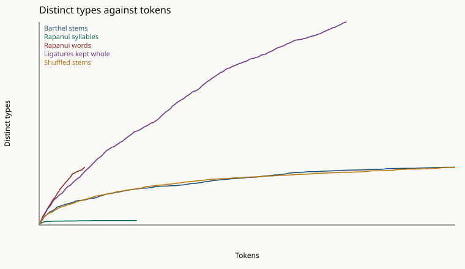
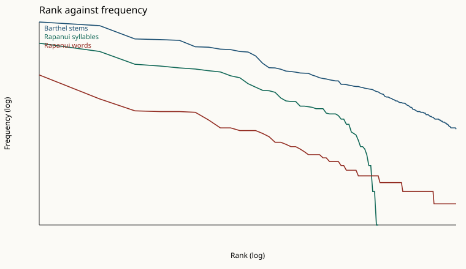
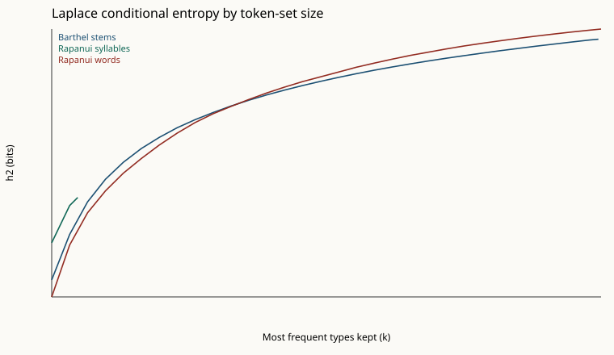

# Track 2: does rongorongo behave like a Rapanui syllabary?

**Verdict: mixed.** The stem inventory is larger than a Rapanui syllabary and smaller than the Rapanui word inventory at the same token count. This is a statistical classification of the vendored Barthel corpus against a Rapanui sample. It is not a decipherment, and it does not assign a reading to any sign.

Structure index of Barthel stems against a shuffle of the same stems: 0.098. At 3400 tokens, stem types = 394 and Rapanui syllable types = 49 (ratio 8.041). At 1591 tokens, stem types = 273 and Rapanui word types = 633 (ratio 0.431). The phonological (C)V ceiling used as a reference is 55. Full stem inventory: 630 types in 14488 tokens.

Dropping 0 exact duplicate stem lines leaves the class **mixed** (630 types, 14488 tokens).

A frequency-rank alignment was scored against random bijections. It is not proposed. Adoption requires a syllabic verdict and a transition cosine that beats 95% of the bijections. Neither condition is treated as a reading.

## Corpus

Barthel numbers are read from the Kohaumotu HTML already under `tests/fixtures`. Hyphen-separated `<td>` text is copied. Sides with no digit transcription are skipped. JSON twins of the same side, and the Mamari calendar extract, are not added again. Drawings and transliteration follow C.E.I.P.P. after Thomas Barthel; the hosted copy is Kohaumotu (`http://kohaumotu.org/rongorongo_org/copy.html`: copy and non-profit distribution with the source acknowledged). Barthel's catalog is Thomas S. Barthel, *Grundlagen zur Entzifferung der Osterinselschrift* (Hamburg, 1958).

37 sides are in the sample.

| Side | Stem tokens | Vendored file |
|---|---:|---|
| Aa | 900 | `tests/fixtures/tahua_aa_html/Aa.html` |
| Ab | 921 | `tests/fixtures/tahua_ab_html/Ab.html` |
| Br | 557 | `tests/fixtures/aruku_br_html/Br.html` |
| Bv | 732 | `tests/fixtures/aruku_bv_html/Bv.html` |
| Ca | 512 | `tests/fixtures/mamari_ca_html/Ca.html` |
| Cb | 473 | `tests/fixtures/mamari_cb_html/Cb.html` |
| Da | 137 | `tests/fixtures/echancree_da_html/Da.html` |
| Db | 103 | `tests/fixtures/echancree_db_html/Db.html` |
| Er | 458 | `tests/fixtures/keiti_er_html/Er.html` |
| Ev | 422 | `tests/fixtures/keiti_ev_html/Ev.html` |
| Fa | 36 | `tests/fixtures/chauvet_fa_html/Fa.html` |
| Fb | 9 | `tests/fixtures/chauvet_fb_html/Fb.html` |
| Gr | 351 | `tests/fixtures/small_santiago_gr_html/Gr.html` |
| Gv | 353 | `tests/fixtures/small_santiago_gv_html/Gv.html` |
| Hr | 770 | `tests/fixtures/large_santiago_hr_html/Hr.html` |
| Hv | 826 | `tests/fixtures/large_santiago_hv_html/Hv.html` |
| Ia | 2431 | `tests/fixtures/santiago_ia_html/Ia.html` |
| Ja | 2 | `tests/fixtures/reimiro_ja_html/Ja.html` |
| Kr | 121 | `tests/fixtures/small_london_kr_html/Kr.html` |
| Kv | 94 | `tests/fixtures/small_london_kv_html/Kv.html` |
| La | 51 | `tests/fixtures/reimiro_la_html/La.html` |
| Ma | 48 | `tests/fixtures/vienna_ma_html/Ma.html` |
| Na | 140 | `tests/fixtures/vienna_na_html/Na.html` |
| Nb | 94 | `tests/fixtures/vienna_nb_html/Nb.html` |
| Oa | 92 | `tests/fixtures/boomerang_oa_html/Oa.html` |
| Pr | 823 | `tests/fixtures/large_st_petersburg_pr_html/Pr.html` |
| Pv | 735 | `tests/fixtures/large_st_petersburg_pv_html/Pv.html` |
| Qr | 495 | `tests/fixtures/small_st_petersburg_qr_html/Qr.html` |
| Qv | 401 | `tests/fixtures/small_st_petersburg_qv_html/Qv.html` |
| Ra | 249 | `tests/fixtures/atua_ra_html/Ra.html` |
| Rb | 207 | `tests/fixtures/atua_rb_html/Rb.html` |
| Sa | 365 | `tests/fixtures/washington_sa_html/Sa.html` |
| Sb | 384 | `tests/fixtures/washington_sb_html/Sb.html` |
| Ta | 146 | `tests/fixtures/honolulu_ta_html/Ta.html` |
| Ua | 24 | `tests/fixtures/honolulu_ua_html/Ua.html` |
| Va | 26 | `tests/fixtures/honolulu_va_html/Va.html` |
| Wa | 0 | `tests/fixtures/honolulu_w_html/Wa.html` |

Illegible `000` is dropped (353 stem tokens). Parenthetical lacuna ranges such as `(6-8)!` are dropped. Ligatures written with `.` or `:` are split in the stem inventory. Letter suffixes (`378y`, `040a`) and a leading orientation `V` are stripped, which is the same mechanical stem used by the Mamari scoreboards. Those choices are the `stem` mode below.

The Rapanui sample is documented in `data/rapanui/SOURCES.md`. Primary running text: Thomson 1891 chants, love song excluded, orthography `strict` (3400 syllables, 1591 words, 54 words rejected). Strict Thomson syllables: 3400 (rejected words 54). Mapped Thomson syllables: 3579 (inventory 49). Wikipedia `lang=rap` spans, strict: 454 syllables, inventory 45. Wikipedia spans are not pooled into the chant conditional entropy.

## Sign-variant options

Each mode is switchable in `decipherment.inventories.encode_lines`.

| Mode | What it does | Types in this run |
|---|---|---:|
| `surface` | Split ligatures; keep allograph letters | 1582 |
| `stem` | Split ligatures; strip allograph letters. Primary sample | 630 |
| `ligature_atomic` | Keep dot and colon ligatures as one sign | 2210 |
| `pozdniakov_52` | Collapse stems outside the published basic list to `RES` | 52 |
| `frequency_core_52` | Keep the 52 most frequent stems; collapse the tail to `RES` | 53 |
| `stem_merge_6_64` | Map Barthel `064` to `006` | 629 |

Pozdniakov's 52 labels (52 names, including `27a` and `901`) are the list printed from Pozdniakov & Pozdniakov 2007. `901` is not a Barthel number. `27a` is stored as stem `027`, which also absorbs Barthel `27b` because the stemmer cannot see the inversion. The Barthel-applicable set therefore has 51 stems. Membership coverage of stem tokens is 0.532. That is not the 99.7% figure: the published merge table that would fold other Barthel numbers into these signs is not in this repository, and it is not invented here. Membership in the published 51 Barthel stems (27a→027, 901 absent). Signs outside that list collapse to RES. This is not Pozdniakov's unpublished allograph merge, so coverage is not expected to reach 99.7%.

`frequency_core_52` coverage is 0.649. Top 52 Barthel stems by frequency in this corpus, tail collapsed to RES. A frequency cutoff, not the Pozdniakov catalog.

The hand pair is the one substitution Wikipedia attributes to Pozdniakov's parallel phrases: sign 6 and sign 64. Stem `064` occurs 130 times; stem `006` occurs 337 times. The flag defaults off.

Citations: Konstantin Pozdniakov, "Les bases du déchiffrement de l'écriture de l'île de Pâques," *Journal de la Société des Océanistes* 103 (1996): 289–303. Igor Pozdniakov and Konstantin Pozdniakov, "Rapanui writing and the Rapanui language: preliminary results of a statistical analysis," *Forum for Anthropology and Culture* 3 (2007): 89–122. The 52-sign count and the 99.7% claim are the 2007 result. The 1996 paper is the parallel-text study those later counts rest on.

## Inventory growth

Heaps exponent β is the OLS slope of log(types) on log(tokens) for n ≥ 50. V(n) is types in the first n tokens. A syllabary of a five-vowel (C)V language should flatten near the phonological ceiling of 55 (10 consonants × 5 vowels + 5 bare vowels; the "ten consonants and five vowels" count is the vendored Wikipedia phonology section, and the full crossing is an assumption).

| Sample | Tokens | Types | β | V(100) | V(250) | V(500) | V(1000) | V(2000) | V(4000) | V(8000) |
|---|---:|---:|---:|---:|---:|---:|---:|---:|---:|---:|
| Barthel stems | 14488 | 630 | 0.422 | 54 | 113 | 161 | 232 | 301 | 416 | 537 |
| Surface allographs | 14488 | 1582 | 0.567 | 59 | 144 | 231 | 397 | 589 | 772 | 1185 |
| Ligatures kept whole | 10698 | 2210 | 0.722 | 75 | 159 | 267 | 421 | 712 | 1123 | 1881 |
| Rapanui syllables | 3400 | 49 | 0.142 | 26 | 39 | 43 | 44 | 49 | — | — |
| Rapanui words | 1591 | 633 | 0.813 | 74 | 151 | 284 | 490 | — | — | — |

## Zipf

Slope and R² are OLS of log(frequency) on log(rank). The second pair drops hapaxes, which otherwise sit on a horizontal line at frequency 1.

| Sample | Slope (all ranks) | R² | Slope (frequency ≥ 2) | R² |
|---|---:|---:|---:|---:|
| Barthel stems | -1.532 | 0.935 | -1.369 | 0.940 |
| Rapanui syllables | -1.236 | 0.695 | -1.103 | 0.784 |
| Rapanui words | -0.706 | 0.886 | -0.888 | 0.974 |

Most frequent stems and syllables (primary samples). Frequency order is not a reading.

| Stem | Count |
|---|---:|
| 001 | 769 |
| 076 | 682 |
| 002 | 442 |
| 003 | 432 |
| 004 | 422 |
| 600 | 342 |
| 006 | 337 |
| 022 | 316 |
| 200 | 311 |
| 010 | 293 |
| 700 | 288 |
| 005 | 253 |
| 009 | 199 |
| 090 | 172 |
| 007 | 171 |

| Syllable | Count |
|---|---:|
| a | 384 |
| i | 293 |
| te | 193 |
| ta | 182 |
| ra | 171 |
| ki | 165 |
| e | 156 |
| ka | 150 |
| u | 132 |
| ma | 124 |
| to | 102 |
| ri | 91 |
| ro | 82 |
| ha | 81 |
| tu | 77 |

## Conditional entropy

h1 is the unigram entropy. h2 is H(next | previous) inside lines, which is the conditional entropy in Rao et al., *Science* (2009), "Entropic Evidence for Linguistic Structure in the Indus Script." Laplace h2 uses add-one smoothing over the observed inventory. Dividing Laplace h2 by log2(V) is reported and is not a gate. On this corpus the rigid cycle has MLE h2 = 0.000 and Laplace h2 / log2(V) = 0.988: add-one smoothing pushes the ratio toward 1 whenever the inventory is large and most successors are unseen. The structure index is `1 - h2(text) / h2(shuffle)` on the MLE, so the shuffle keeps the same inventory, the same line lengths, and the same token frequencies. Stem structure index = 0.098. Syllable structure index = 0.144. Word structure index = 0.343. The word index is inflated by hapaxes: a word seen once has only one observed successor. Sproat's critique stands: a mid-range conditional entropy by itself does not prove that a sign system is writing. The class above uses the stem structure index only as a gate, then uses inventory size.

| Sample | h1 unigram | h2 conditional (MLE) | h2 Laplace | h2 Laplace / log2 V | XX rate |
|---|---:|---:|---:|---:|---:|
| Barthel stems | 7.249 | 4.888 | 8.999 | 0.968 | 0.032 |
| Shuffled stems | 7.249 | 5.419 | 9.069 | 0.975 | 0.016 |
| Rigid cycle | 9.299 | 0.000 | 9.185 | 0.988 | 0.000 |
| Uniform random | 9.269 | 4.491 | 9.280 | 0.998 | 0.002 |
| Rapanui syllables | 4.926 | 3.870 | 4.870 | 0.867 | 0.030 |
| Rapanui words | 7.914 | 1.663 | 9.263 | 0.995 | 0.006 |

Rao-style curves: Laplace h2 after keeping the k most frequent types and collapsing the rest to one residual class. Step size 20.

| k | Stems | Syllables | Words |
|---:|---:|---:|---:|
| 20 | 2.723 | 3.690 | 2.279 |
| 40 | 3.908 | 4.661 | 3.631 |
| 60 | 4.758 | — | 4.473 |
| 80 | 5.348 | — | 5.044 |
| 100 | 5.789 | — | 5.505 |
| 120 | 6.147 | — | 5.886 |
| 140 | 6.439 | — | 6.238 |
| 160 | 6.690 | — | 6.548 |
| 180 | 6.900 | — | 6.824 |
| 200 | 7.085 | — | 7.054 |
| 220 | 7.255 | — | 7.245 |
| 240 | 7.407 | — | 7.426 |
| 260 | 7.546 | — | 7.596 |
| 280 | 7.673 | — | 7.751 |
| 300 | 7.790 | — | 7.893 |
| 320 | 7.899 | — | 8.018 |
| 340 | 8.003 | — | 8.142 |
| 360 | 8.099 | — | 8.268 |
| 380 | 8.190 | — | 8.375 |
| 400 | 8.274 | — | 8.479 |
| 420 | 8.353 | — | 8.574 |
| 440 | 8.429 | — | 8.660 |
| 460 | 8.501 | — | 8.743 |
| 480 | 8.569 | — | 8.820 |
| 500 | 8.635 | — | 8.890 |
| 520 | 8.697 | — | 8.956 |
| 540 | 8.757 | — | 9.019 |
| 560 | 8.814 | — | 9.078 |
| 580 | 8.870 | — | 9.133 |
| 600 | 8.924 | — | 9.185 |
| 620 | 8.976 | — | 9.235 |
| 630 | 8.999 | — | — |

Adjacent repetition (XX) is in the entropy table. ABAB rate (a repeated pair that is not XX): stems 0.016, syllables 0.014, words 0.001. Full reduplication of a parsed word (the syllable string is two identical halves): 37 / 1536 = 0.024. Hapax stems: 170 of 630.

## Position in the line

Among types with frequency at least 10, the share that occur in initial, medial, and final position. For stems the boundary is the inscribed line. For syllables the boundary is the orthographic word (first syllable, interior syllables, last syllable). Those are different boundaries. The chant sample is four long sections, so inscribed-line edges on the syllable stream are not used.

| Sample | Boundary | Frequent types | In all three positions |
|---|---|---:|---:|
| Barthel stems | inscribed line | 193 | 0.316 |
| Rapanui syllables | word edge | 43 | 0.930 |
| Rapanui words | chant section | 25 | 0.000 |

## Frequency alignment

Adopt only if the verdict is syllabic and the rank alignment's transition cosine beats at least 95% of random bijections (null fraction <= 0.05). Adoption is still a hypothesis, not a reading.

k = 30. Permutations = 200. Transition-matrix cosine = 0.404. Fraction of random bijections with cosine at least that high = 0.000. Spearman correlation of self-repetition rates = 0.262. Fraction of bijections with Spearman at least that high = 0.120. Adopted = False.

No sign is given a gloss. `reading` is None.

## Decision rule

The rule is `classify_writing_system` in `decipherment/track2.py`.

1. Structure index below 0.05: non-linguistic (no order beyond the unigram shuffle).
2. Structure index above 0.85: non-linguistic (rigid).
3. Else, at n = min(stem tokens, syllable tokens): syllabic if stem types ≤ 120 and stem types / syllable types ≤ 1.6.
4. Else, at n = min(stem tokens, word tokens): logographic if stem types ≥ 250 and stem types / word types ≥ 0.7.
5. Else: mixed.

Thresholds were set before the corpus totals were used to edit them. Duplicate-line removal is a sensitivity check, not the primary label.

## What this does not claim

The class is not a translation. A mixed label means the Barthel-stem sequences are language-like in order and sit between a Rapanui syllabary and a Rapanui word list in inventory growth. It does not identify which signs are syllabic and which are logographic. Pozdniakov's 99.7% coverage is not reproduced here, because the allograph merges that produced it are not vendored. Thomson's chants are a damaged 19th-century record; the strict orthography throws away words the filter cannot parse, and the mapped orthography is an explicit substitution list. Conditional entropy is one comparison among several, and a value inside the linguistic band is not, by itself, proof of writing.

The run uses `MockProvider` only. Provider calls: 0.
